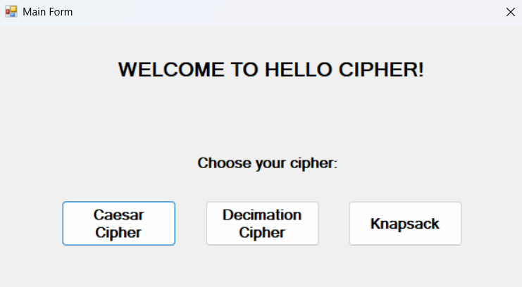
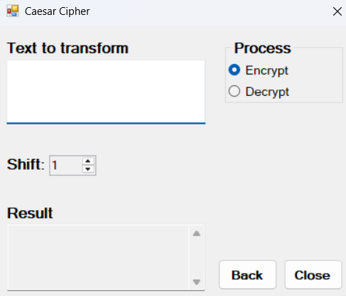
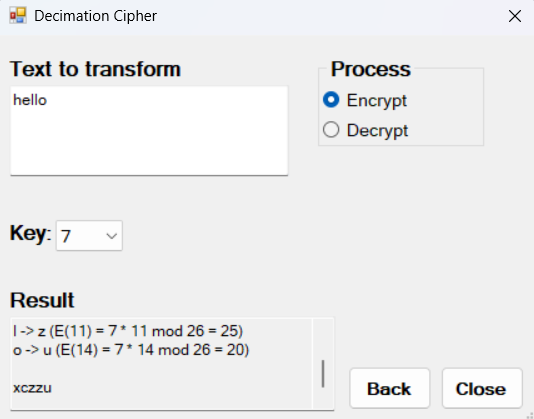
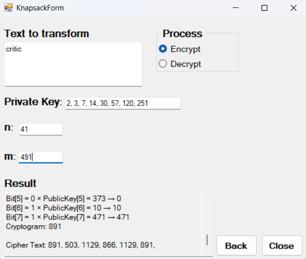

# Hello Cipher - Cryptography and Network Security Project

This repository contains the **Hello Cipher** project, developed as a college assignment for a Cryptography and Network Security course. This application is designed to demonstrate fundamental cryptographic concepts by providing implementations of various ciphers for encryption and decryption. It is built using Visual Basic .NET.

## Introduction

The `Hello Cipher` is a desktop application built with Visual Basic .NET that provides a hands-on way to understand classic cryptographic algorithms. It allows users to encrypt and decrypt text messages using three distinct cipher methods: Caesar Cipher, Decimation Cipher, and Knapsack Cipher. This project serves as an educational tool to visualize how these ciphers work.

## Features

* **Caesar Cipher**: Implementations for encrypting and decrypting text using the Caesar cipher method.

* **Decimation Cipher**: Implementations for encrypting and decrypting text using the Decimation cipher method.

* **Knapsack Cipher**: Implementations for encrypting and decrypting text using the Knapsack cipher method.

* **User-Friendly Interface**: An intuitive Windows Forms interface for inputting text, selecting ciphers, and viewing results.

* **Encryption/Decryption Functionality**: Clear separation and execution of encryption and decryption processes for each cipher.

## Technologies Used

* **Visual Studio**: The application used to create this project.

* **Visual Basic .NET (VB.NET)**: The primary programming language.

* **.NET Framework**: For building the Windows Forms application.

## App Preview
### Welcome Screen

### Caesar Cipher Form

### Decimation Cipher Form

### Knapsack Cipher Form

